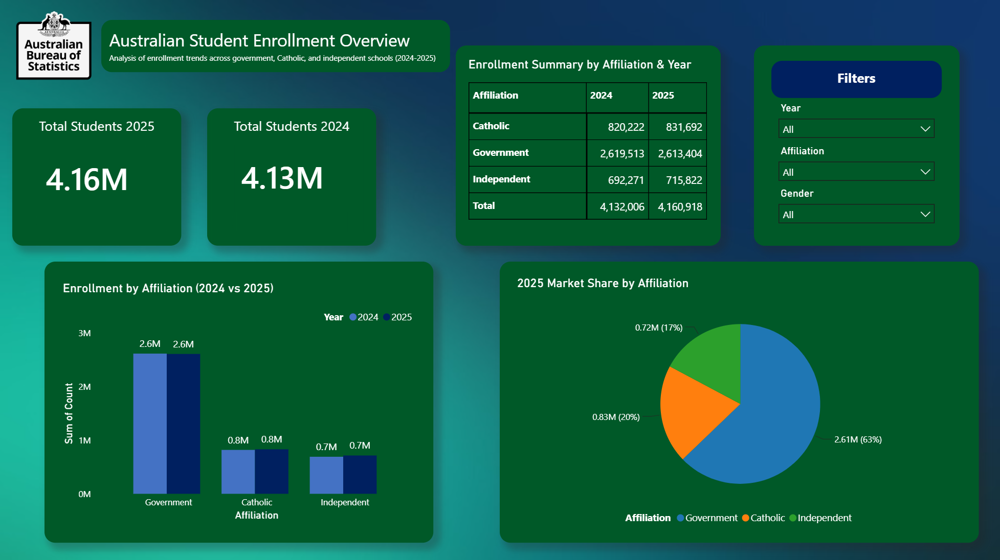
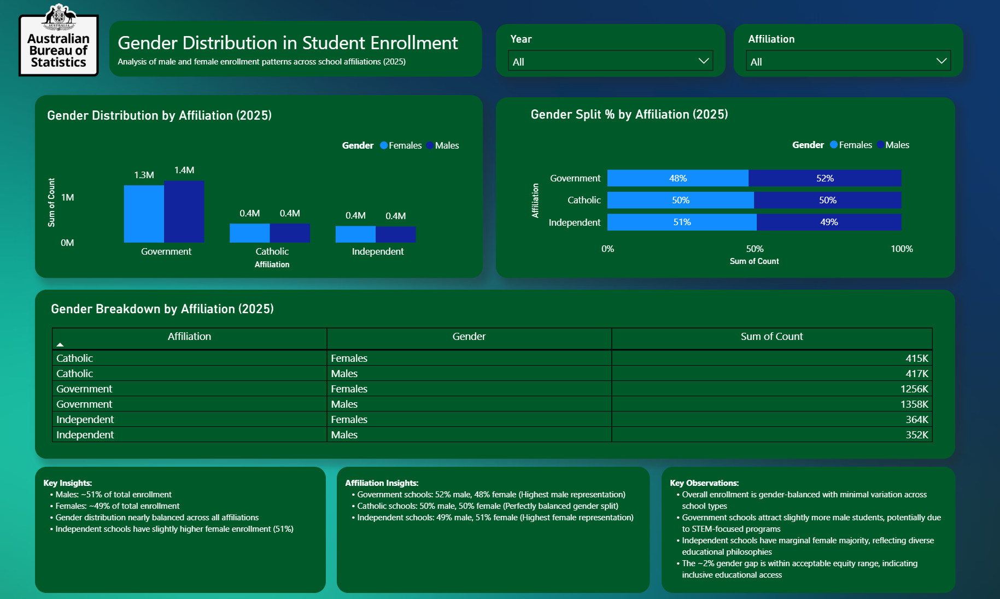
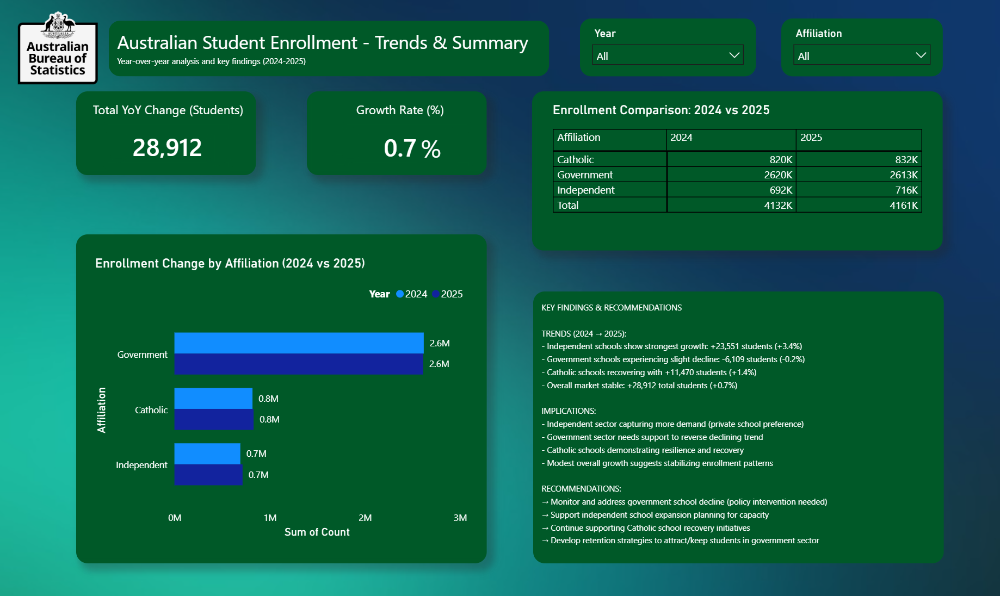
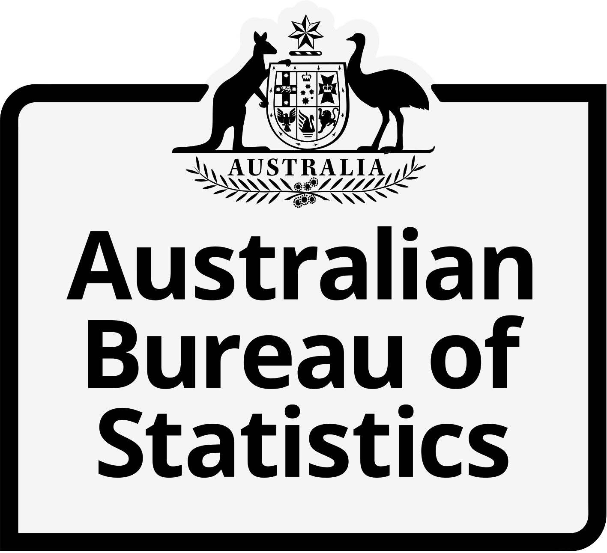

# 📊 Australian Student Enrollment Dashboard

A comprehensive Power BI dashboard analyzing Australian student enrollment trends across government, Catholic, and independent schools (2024-2025).

---

## 🎯 Project Overview

This interactive Power BI dashboard provides deep insights into student enrollment patterns, gender distribution, and year-over-year trends across Australian school affiliations. Built with data from the Australian Bureau of Statistics (ABS), the dashboard enables policymakers, educators, and stakeholders to make data-driven decisions about education planning and resource allocation.

**Key Metrics:**
- **Total Enrollment (2025):** 4.16M students
- **YoY Growth:** +28,912 students (+0.7%)
- **Market Share:** Government 63%, Catholic 20%, Independent 17%
- **Gender Balance:** 51% male, 49% female

---

## 📈 Dashboard Pages

### **Page 1: Overview**
Comprehensive overview of student enrollment with key performance indicators and market analysis.



**Features:**
- KPI Cards showing total students (2025 vs 2024)
- Clustered column chart comparing enrollment by affiliation
- Pie chart showing 2025 market share distribution
- Summary table with 2024 vs 2025 comparison
- Interactive filters: Year, Affiliation, Gender

**Key Insights:**
- Government schools dominate with 2.61M students (63%)
- Catholic schools serve 0.83M students (20%)
- Independent schools enroll 0.72M students (17%)
- Minimal YoY change indicates stable enrollment patterns

---

### **Page 2: Gender Analysis**
Deep dive into gender distribution patterns across school types.



**Features:**
- Clustered column chart showing male vs female enrollment
- 100% stacked bar chart revealing gender percentage split
- Gender breakdown table with detailed enrollment figures
- Three insight text boxes with key findings and observations

**Key Insights:**
- **Overall Balance:** 51% male, 49% female (nearly perfect gender parity)
- **Government Schools:** 52% male, 48% female (highest male representation)
- **Catholic Schools:** 50% male, 50% female (perfectly balanced)
- **Independent Schools:** 49% male, 51% female (highest female representation)
- Gender gap of ~2% is within acceptable equity range

---

### **Page 3: Trends & Summary**
Comprehensive year-over-year analysis and strategic recommendations for education stakeholders.



**Features:**
- **KPI Cards (Top):**
  - Total YoY Change: +28,912 students (absolute growth)
  - Growth Rate: +0.7% (percentage change year-over-year)
  - Visual indicators for positive/stable growth trends

- **Horizontal Bar Chart (Left):**
  - Enrollment Change by Affiliation (2024 vs 2025)
  - Visual comparison showing bars for each school type
  - Data labels displaying exact enrollment numbers
  - Legend indicating 2024 vs 2025 for easy comparison

- **Enrollment Comparison Matrix (Right):**
  - 2024 vs 2025 side-by-side data
  - Affiliation breakdown: Catholic, Government, Independent, Total
  - Formatted numbers with thousands separator for readability
  - Quick reference table for detailed enrollment figures

- **Key Findings & Recommendations Text Box (Bottom-Right):**
  - TRENDS section: Detailed analysis of each affiliation's growth/decline
  - IMPLICATIONS section: What these trends mean for education sector
  - RECOMMENDATIONS section: Actionable steps for government, independent, and Catholic sectors

**Detailed Insights:**
- **Independent Schools:** Strongest growth +23,551 students (+3.4%) 📈
  - Indicates private school preference trend
  - Requires infrastructure planning for capacity building
  
- **Government Schools:** Slight decline -6,109 students (-0.2%) 📉
  - Concerning trend requiring policy intervention
  - Needs retention and attraction strategies
  - Must strengthen specialized programs (STEM focus)
  
- **Catholic Schools:** Recovery momentum +11,470 students (+1.4%) 📈
  - Demonstrating resilience after challenges
  - Positioned for sustainable growth
  - Should leverage stability for program investment

- **Overall Market:** Modest +0.7% growth suggests stabilization
  - Market appears to have found equilibrium
  - Sector shifts from government to independent occurring
  - Overall demand remains relatively stable

**Strategic Recommendations:**

*For Government Sector:*
- Monitor enrollment decline trends closely
- Implement policy interventions to reverse decline
- Develop targeted retention strategies
- Strengthen STEM and specialized offerings
- Improve marketing and community engagement

*For Independent Sector:*
- Plan for continued growth (+3.4%)
- Invest in infrastructure capacity
- Maintain quality standards during expansion
- Prepare teaching staff recruitment strategies

*For Catholic Sector:*
- Continue current recovery initiatives
- Leverage stable growth for program development
- Enhance community partnerships
- Invest in marketing and visibility

**Interactive Elements:**
- Year filter for historical comparison
- Affiliation filter to drill down into specific sectors
- Responsive layout that adapts to different screen sizes
- Tooltips on charts for detailed data inspection

---

## 🎨 Design & Branding

### Professional Styling
- **Color Scheme:** Teal, green, and navy blue gradient background
- **Logo:** Australian Bureau of Statistics official branding
- **Typography:** Clean, professional sans-serif fonts
- **Layout:** Balanced, responsive design across all pages




---

## 📊 Data Sources

**Australian Bureau of Statistics (ABS)**
- Table 32a: Non-special schools by primary enrollment (2004-2025)
- Table 33a: Non-special schools by secondary enrollment (2004-2025)
- Table 90a: Key information by states and territories (2024-2025)

**Data Coverage:**
- Time Period: 2024-2025 financial years
- School Types: Government, Catholic, Independent
- Student Categories: Males, Females, Total (Persons)
- Geographic Scope: Australia-wide

---

## 🛠️ Technical Stack

**Tools & Technologies:**
- **Power BI Desktop** - Dashboard development and visualization
- **R 4.5.2** - Data cleaning and preprocessing
- **Excel** - Source data files (ABS tables)
- **GitHub** - Version control and deployment

**Key Libraries (R):**
```r
tidyverse    # Data manipulation and visualization
readxl       # Excel file reading
dplyr        # Data wrangling
ggplot2      # Graphical visualization
```

---

## 🚀 Getting Started

### Prerequisites
- Power BI Desktop (latest version)
- R 4.0+ (for data processing)
- Excel or CSV viewer

### Installation

**Step 1: Clone/Download the Repository**
```bash
git clone https://github.com/varun-2901/student-enrollment-dashboard.git
cd student-enrollment-dashboard
```

**Step 2: Clean the Data (Optional)**
```bash
Rscript scripts/clean_enrollment_data.R
```
This creates `data/processed/enrollment_cleaned.csv` from raw ABS files.

**Step 3: Open the Dashboard**
1. Open `Power BI Desktop`
2. File → Open → Select `dashboard/Student_Enrollment_Dashboard.pbix`
3. Data will load automatically from processed files

**Step 4: Explore Interactively**
- Use Year, Affiliation, and Gender filters
- Click charts to drill down
- Hover over data points for details

---

## 📊 Key Features

### Interactive Filters
- **Year:** Toggle between 2024 and 2025
- **Affiliation:** Select Government, Catholic, Independent, or Total
- **Gender:** Choose Males, Females, or Persons (Total)

### Dynamic Visualizations
- Column charts update with filter selections
- Pie charts recalculate market share instantly
- Tables refresh to show filtered data
- KPI cards display real-time metrics

### Mobile Responsive
- Desktop optimized layout
- Charts scale to screen size
- Filters accessible on all devices

---

## 📈 Key Findings & Insights

### Enrollment Trends (2024 → 2025)

| Affiliation | 2024 | 2025 | Change | % Change |
|---|---|---|---|---|
| **Government** | 2,619,513 | 2,613,404 | -6,109 | -0.2% |
| **Catholic** | 820,222 | 831,692 | +11,470 | +1.4% |
| **Independent** | 692,271 | 715,822 | +23,551 | +3.4% |
| **TOTAL** | 4,132,006 | 4,160,918 | +28,912 | +0.7% |

### Strategic Insights

**1. Sector Performance**
- Independent schools outperforming with +3.4% growth
- Government sector experiencing decline (-0.2%) - requires intervention
- Catholic schools demonstrating recovery momentum (+1.4%)

**2. Market Dynamics**
- Overall market stable with modest +0.7% growth
- Independent sector capturing increasing demand (private school preference trend)
- Government sector needs retention strategies

**3. Gender Equity**
- Nearly perfect gender balance (51% M / 49% F)
- Consistent across all school types
- ~2% gap well within acceptable equity range

---

## 💡 Recommendations

### For Government Sector
→ Monitor and address enrollment decline with policy intervention  
→ Develop retention strategies to attract/keep students  
→ Strengthen STEM and specialized programs  

### For Independent Sector
→ Support expansion planning for capacity building  
→ Prepare infrastructure for growing enrollment  
→ Maintain quality standards during growth phase  

### For Catholic Sector
→ Continue supporting recovery initiatives  
→ Leverage stability to invest in program development  
→ Enhance marketing and community engagement  

---

## 📧 Usage & Sharing

### Viewing the Dashboard
1. **Locally:** Open `.pbix` file in Power BI Desktop
2. **Online:** Publish to Power BI Service for web access
3. **Stakeholders:** Share via Power BI links with permission controls

### Exporting Reports
```
File → Export to PowerPoint
File → Export to PDF
File → Share → Get a link
```

### Updating Data
Simply replace files in `data/raw/` with latest ABS tables and refresh in Power BI:
```
Home → Refresh
```

---

## 📚 Documentation

### Data Dictionary

**enrollment_cleaned.csv Columns:**
- `Affiliation` - School type (Government, Catholic, Independent, Total)
- `Gender` - Student gender (Males, Females, Persons)
- `Year` - Academic year (2024, 2025)
- `Count` - Number of students enrolled

**Measures (DAX Formulas):**
- `YoY_Absolute_Change` - Absolute difference between years
- `YoY_Percent_Change` - Percentage change year-over-year
- `Pct_of_Affiliation` - Percentage within each affiliation

---

## 🔄 Updates & Maintenance

**Scheduled Updates:**
- Quarterly: Refresh data with latest ABS releases
- Annually: Add new academic year data
- As needed: Update recommendations based on trends

**Version History:**
- **v1.0** (Aug 2026) - Initial dashboard release with 3 pages and interactive filters

---

## 📄 License

This project uses data from the Australian Bureau of Statistics under Creative Commons Attribution 4.0 International License.

**ABS Data Usage:** Acknowledge the ABS as the source when sharing reports generated from this dashboard.

---

## 👤 Author

**Varun Sridhar**  
Data Engineering Analyst | Melbourne, Australia  
GitHub: [github.com/varun-2901](https://github.com/varun-2901)  
Email: varun.sridhar@example.com

---

## 🤝 Contributing

Contributions welcome! Please:
1. Fork the repository
2. Create a feature branch (`git checkout -b feature/improvement`)
3. Commit changes (`git commit -m 'Add feature'`)
4. Push to branch (`git push origin feature/improvement`)
5. Open a Pull Request

---

## ❓ FAQ

**Q: Can I modify the dashboard for my organization?**  
A: Yes! The `.pbix` file is fully editable. Customize colors, metrics, and filters to your needs.

**Q: How often is data updated?**  
A: Data is updated with latest ABS releases (typically quarterly). Manual refresh recommended.

**Q: Can I add more pages?**  
A: Absolutely! Power BI allows easy addition of new pages with similar structure.

**Q: Is the data real?**  
A: Yes, all data comes directly from Australian Bureau of Statistics official releases.

---

## 📞 Support

For issues, questions, or suggestions:
1. **GitHub Issues:** Create an issue in the repository
2. **Email:** varun.sridhar@example.com
3. **Documentation:** See project README and inline comments

---

## 🙏 Acknowledgments

- **Australian Bureau of Statistics** for comprehensive education data
- **Power BI Community** for visualization best practices
- **Monash University** for analytical foundation and Master's support

---

**Last Updated:** August 2026  
**Dashboard Version:** 1.0  
**Status:** Production Ready ✅

---

**Share your feedback and help improve education analytics!** 🎓📊
